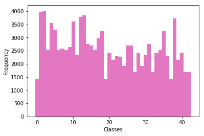

##Data Set Summary & Exploration##

[Link to Project Code](https://github.com/RUNINDC/Traffic-Signs-Classifier/blob/master/Traffic%2BSigns%2BClassifier%2BProject.html)

####2. Provide a basic summary of the data set and identify where in your code the summary was done. In the code, the analysis should be done using python, numpy and/or pandas methods rather than hardcoding results manually.

###Data Set Summary & Exploration

####1. Basic summary.

Code for this step is contained in the fifth code cell of the IPython notebook.

I used the pandas library to calculate summary statistics of all the traffic signs data set:

Number of training examples = 34799  
Number of testing examples = 12630  
Image data shape = (32, 32, 3)  
Number of classes = 43  

X_train shape: (83245, 32, 32, 1)  
y_train shape: (83245,)  
X_test shape: (12630, 32, 32, 3)  
y_test shape: (12630,)  

####2. Exploratory visualization

The code for this step is contained in the third code cell of the IPython notebook.

Here's an exploratory visualization of the data set.

###Design and Test a Model Architecture###

The code for this step is contained in the 6th - 12th code cells of the IPython notebook.  I first converted the images to grayscale.

As a last step, I normalized the image data in order to bring out features we wouldn't be able to see otherwise.

**Question 1
Describe the techniques used to preprocess the data.**

For Data Reduction, I converted the images from RGB to grayscale - that way we don't have to preprocess the image with all three color channels seperately. This will improve the speed of the algorithm without sacrificing quality.

Also I one-hot encoded the labels to make computing the cross entropy for the loss function possible. 

####2. Describe how, and identify where in your code, you set up training, validation and testing data. How much data was in each set? Explain what techniques were used to split the data into these sets

**Question 2
Describe how you set up the training, validation and testing data for your model.**

I built the validation set choosing random data, then applied the following methods: skew, perspective transforms and rotation.

**Question 3

**What does your final architecture look like?**

I used CNN to constrain the architecture in a more sensible fashion with layers arranged in width, height & depth dimensions.

I decided to use 4 layers: 2 convolutional layers for feature extraction and 1 fully connnected layer as a classifier.

Since there's no perfect way to choose the best architecture, the number of layers (convolutional and fixed) activation functions, number of neurons, is mostly empirical.

mu = 0 sigma = 0.1

**Layer 1:**
Convolution of 5x5 kernel, 1 stride, 24 feature maps.  Activation: ReLU Pooling 1: 2x2 kernel and 2 stride.

**Layer 2:**
Convolution of 3x3 kernel, 1 stride and 32 feature maps Activation: ReLU Pooling 2: 2X2 kernel and 2 stride

**Layer 3:** 
Fully connected layer with 512 units. ReLU activation

**Layer 4:** Fully connnected with 256 units Activation: ReLU  
Output Layer: Fully connected with 43 units for logits output. Activation: Softmax

**Batch size** results in the the number of examples to analyze with each update. The lower it is, the noisier the training signal is going to be, the higher it is, the longer it will take to compute the gradient for each step.  That is why I chose a Batch size of 128.

**Question 4. How did you train your model?**

Adam optimizer with 0.001 Batch size. 128 Epochs and 15 Hyperparameters. Mean = 0; Standard Deviation of 0.1

Was able to achieve .998 accuracy by Epoch 15.

(If the epoch size is small, will not be able to obtain high accuracy)

**Question 5 What approach did you take in coming with a solution to this problem?**

I used the Adam Optimizer because it performed well being adaptive.  With lower epochs, was able to obtain high accuracy. 

**Dropouts:** To not overfit the data, I implemented dropouts.
Used dropout of 0.5 for training and 1.0 for validation - this really helped with generalization of the model.

**Question 7**
Is your model able to perform equally well on captured pictures when compared to testing on the dataset? The simplest way to do this check the accuracy of the predictions. For example, if the model predicted 1 out of 5 signs correctly, it's 20% accurate.

In the test set, the accuracy was 95%, but in the captured images, the accuracy was only 20% (1 out of 5)

**Question 8**

Use the model's softmax probabilities to visualize the certainty of its predictions, tf.nn.top_k could prove helpful here. Which predictions is the model certain of? Uncertain? If the model was incorrect in its initial prediction, does the correct prediction appear in the top k? (k should be 5 at most)

Image 1: Model failed completely. Confused the "7" as a left arrow.
Image 2: Model failed completely. Confused the circular lines to a traffic signal. 
Image 3: Model passed: "Right of way at next intersection"  
Image 4: Model failed.  Not included in the training dataset.
Image 5: Model failed completely. Confused arrow slightly turned to left as left turn

**Factors affecting Classification:**
All images were blurry and had poor contrast. A few of the traffic signs were not inncluded in the training data set.  Most of the signs had background objects and the images were jittered with horizontal lines.

Accuracy can be improved by fine tuning of optimizer, epochs, activation function, number of layers, etc.

